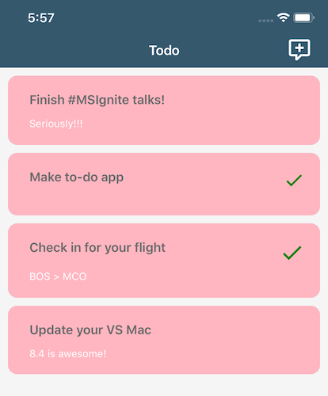

# Create Beautiful Xamarin.Forms Apps – Ignite Workshop

## Objectives:

You should leave this workshop today knowing the following:

- [ ] [Set up Visual Studio for Mac](#setup).
- [ ] [Use FontImageSource to add Material Icons to your UI](#fontimagesource).
- [ ] [Switch your existing `ListView` to `CollectionView`](#collectionview).
- [ ] [Use Frames and background colors/font attributes to make your app more visually appearing](#frames).
- [ ] [Switch your app to use Xamarin.Forms Shell](#shell).
- [ ] [Switch a page of your app to use the Xamarin.Forms Visual system and implement Material design](#material).
- [ ] [Add a simple animation to a page](#effects).



## <a id="setup"></a>Get set up

1. [Download and open the sample from GitHub](https://github.com/maddyleger1/Ignite2019-CreateBeautifulXFApps-Workshop/archive/master.zip) in Visual Studio for Mac.

2. Open the .sln file within the **Start** folder. Once it opens in the IDE, double click on **TodoListPage.xaml** in the Views folder to open it in the editor.

3. The next step is to enable the Hot Reload feature, which allows us to preview changes while the app is running. To do this go to: **Visual Studio > Preferences > Project > XAML Hot Reload** and select **Enable Hot Reload (Preview)**.

4. Start debugging the app by selecting **Debug | iOS Simulator** in the toolbar and press the Play button.
Feel free to play around with the app in the simulator.

## <a id="fontimagesource"></a>Use FontImageSource for beautiful icons

5. The first step in making this app beautiful is to update the toolbar button to look a little better. This is done by using the `FontImageSource` capabilities available in Xamarin.Forms 4.0 and later. The necessary font file has already been to the projects for you, and has been added as an app-wide `StaticResource`. To change the toolbar icon, replace the `ToolbarItem.IconImageSource` code in the **TodoListPage.xaml** file with:

    ```xml
    <ToolbarItem.IconImageSource>
        <FontImageSource 
                Glyph="&#xf183;"
                FontFamily="{StaticResource MaterialFontFamily}"
                Size="32" />
    </ToolbarItem.IconImageSource>
    ```

    Save the changes to see them reflected on the simulator.

6. Do the same with checkmark icon for each item – you can see the checkmark by clicking an item and marking it as "Done". Find a [glyph]((https://cdn.materialdesignicons.com/4.5.95/)) you'd like to replace the existing icon with. 

    Replace the `<Image>` tag on line 37 with:

    ```xml
    <Image IsVisible="{Binding Done}"
            Grid.Column="2"
            Grid.RowSpan="2"
            HorizontalOptions="End"
            Source="{FontImage FontFamily={StaticResource MaterialFontFamily},
                    Glyph=&#xf12c;,
                    Color=Green,
                    Size=32}" />
    ```

## <a id="collectionview"></a>Using a Collection View

7. Let's swap out the `ListView` for a more performant alternative - `CollectionView`, which is new in Xamarin.Forms 4.3. `CollectionView` automatically utilizes the virtualization capabilities of each native platform to make your lists appear faster. It also supports multiple columns of items, and a simpler API with no need for Cells. There are a few steps to change your `ListView` to a `CollectionView`:

    a. Stop debugging your app. We are going to change some C#, which can't be done during a debug session.

    b. Go into the **TodoListPage.xaml.cs** file and comment out the `OnListItemSelected` function. Uncomment the version of it below labeled step 7.

    c. Open **TodoListPage.xaml**. Change all instances of `ListView` to `CollectionView`.

    d. Add `SelectionMode="Single"` to the opening tag of the `CollectionView`. This tells the `CollectionView` that you are only ever selecting one item at a time.

    e. Replace `ItemSelected` with `SelectionChanged` in the opening tag of the `CollectionView`.

    f. Delete the opening and closing `ViewCell` tags (keep the Grid and it's contents inside - CollectionView doesn't need a cell!)

    At the end of step 7, the XAML for your `CollectionView` should look like:

    ```xml
    <CollectionView Margin="20"
                SelectionMode="Single"
                SelectionChanged="OnListItemSelected"
                ItemsSource="{Binding Source={x:Static todo:App.Database}, Path=Items}">
            <CollectionView.ItemTemplate>
                <DataTemplate>
                        <Grid Padding="10">
                            <!--#region Grid definitions-->
                            <Grid.RowDefinitions>
                                <RowDefinition Height="Auto" />
                                <RowDefinition Height="Auto" />
                            </Grid.RowDefinitions>
                            <Grid.ColumnDefinitions>
                                <ColumnDefinition Width="Auto" />
                                <ColumnDefinition Width="Auto" />
                            </Grid.ColumnDefinitions>
                            <!--#endregion-->
                            <Label Grid.Column="1"
                                Text="{Binding Name}"
                                FontAttributes="Bold" />
                            <Image IsVisible="{Binding Done}"
                                Grid.Column="2"
                                Grid.RowSpan="2"
                                HorizontalOptions="End"
                                Source="{FontImage FontFamily={StaticResource MaterialFontFamily},
                                    Glyph=&#xf12c;,
                                    Color=Green,
                                    Size=32}" />
                        </Grid>
                </DataTemplate>
            </CollectionView.ItemTemplate>
    </CollectionView>
    ```

    Start debugging your app again to begin customizing the `CollectionView` using XAML Hot Reload!

## <a id="frames"></a>Working with Frames and ItemTemplates

8. Collection Views don't have line separators, so instead add some color to make the items stand out from the background. Under the `DataTemplate` and before the opening tag for the grid, add a `Frame` tag with a background color. Set the `IsClippedToBounds=True` property on the Frame, to ensure that it respects the bounds:

    ```xml
    <Frame BackgroundColor="LightPink" 
            IsClippedToBounds="True">
    ...
    </Frame>
    ```

9. With the background set, you can notice that the items are overlapping. To fix this, add some spacing around the items:

    ```xml
    <CollectionView.ItemsLayout>
        <LinearItemsLayout ItemSpacing="20" Orientation="Vertical" />
    </CollectionView.ItemsLayout>
    ```

10. Expand each item with the ability to see the item description. Add another label with `Grid.Row="2"`, `Grid.Column="1"`, and set `Text={Binding Notes}`:

    ```xml
        <Label Grid.Row="2"
                Grid.Column="1"
                Text="{Binding Notes}" />
    ```

> **Note**: One great resource to use for themes is [Coolors](https://coolors.co/app). With this site, you can generate complementary colors and adjust some of the following to make your app look beautiful.

* Set a `BackgroundColor` for the Frame, ContentPage, and if you'd like, a new color for the "Done" glyph.
* Change the `TextColor` for the items in the `ItemTemplate`,
* Play around with `FontSize`, and add `FontAttributes` like "bold" or "italics".
* On your Frame, you can also add attributes like `CornerRadius` and `HasShadow`.

## <a id="shell"></a>Adding Xamarin.Forms Shell
{:toc}

Xamarin.Forms Shell reduces the complexity of mobile app development by providing a single place to describe the visual hierarchy of an application. It also benefits your application by increased rendering speed and reduced memory consumption. For more information, see the [Xamarin.Forms Shell](https://docs.microsoft.com/xamarin/xamarin-forms/app-fundamentals/shell/introduction) documentation. Follow the steps below to add Shell to your existing app.

11. Stop debugging your app. We are going to use Shell to describe our hierarchy. We have already added the **AppShell.xaml** file describing a tabbed page for you. Open **AppShell.xaml** and inspect it.

12. In **App.xaml.cs**, comment out where the MainPage.xaml is wired up. Add (or uncomment) initializing a new Shell page. Both areas are noted in the code already. 

13. Start debugging the app again and change around colors in **AppShell.xaml** to customize your app! `NavigationPrimary` sets the top and bottom bars. You can overwrite any of the other attributes on the page including the size and color of the glyphs that make up the tabs. Remember to save your changes to see the updated design.

    Switch between the About tab (feel free to edit!) and the All Items tab. See how the options are respected no matter what page you're on. Change `Shell.TabBarUnselectedColor` and `Shell.TabBarForegroundColor` to see what happens when you switch pages.

## <a id="material"></a>Using Material Design

Xamarin.Forms Material Visual can be used to apply Material Design rules to Xamarin.Forms applications, creating applications that look largely identical on iOS and Android. When Material Visual is enabled, supported views adopt the same design cross-platform, creating a unified look and feel. For more information in Material in Xamarin.Forms, see the [documentation](https://docs.microsoft.com/xamarin/xamarin-forms/user-interface/visual/material-visual).

The **Xamarin.Forms.Visual.Material** NuGet package has already been added and initialized in the iOS and Android settings file using `FormsMaterial.Init()`.

15. On **TodoItemPage.xaml** page add `Visual="Material"` to the Delete button and save your XAML. See the material style button updated with hot reload.

16. Change `Material` to `Default`, and then add `Visual="Material"` to the overall headers of the page and save. Observe how it updates most of the controls on the page and gives it a consistent style.

## <a id="effects"></a>Adding Effects

One great way to make your app visually appealing is by adding some effects on an event. In this example, you'll add a small visual effect that animates the checkmark when then "Done" switch it selected.

18. Add this XAML to **TodoItemPage.xaml** after the buttons:

    ```xml
    <Image x:Name="doneImage"
            VerticalOptions="EndAndExpand"
            Margin="10"
            Source="{FontImage FontFamily={StaticResource MaterialFontFamily},
                                    Color=Green,
                                    Glyph=&#xf12c;,
                                    Size=64}"
            Opacity="0"/>
    ```

19. Go to **TodoItemPage.xaml.cs** and notice the blank event handler for when the switch is toggled. When it's toggled off, we want to set our image back to 0 opacity and its original size, so you don't see it! When it's toggled on, we want to fade in the checkmark and grow it in size!

    Update the code so that it looks like the following:

    ```csharp
    async void Switch_ToggledAsync(object sender, ToggledEventArgs e)
            {
                // Part 13: Effects
                if (e.Value == false)
                {
                    await doneImage.ScaleTo(1, 500);
                }
                else if (e.Value == true)
                {
                    await doneImage.FadeTo(1, 1000);
                    await doneImage.ScaleTo(2, 2000);
                    await doneImage.FadeTo(0, 500);
                }
            }
    ```

20. Finally, run the app and set some of your items to "done" to see the animations in action.

